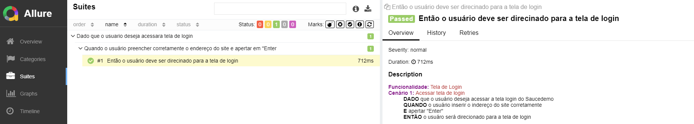

### Introdução
O Cypress é uma ferramenta de automação de teste de front-end que permite escrever, executar e depurar testes facilmente. O Allure Report é uma estrutura de relatórios que fornece uma maneira elegante de visualizar os resultados dos testes.

### Requisitos
- Cypress instalado e configurado no seu projeto.
- Plugin `@shelex/cypress-allure-plugin` instalado para integração com o Allure Report.

### Passos

1. **Importar cenários Gerkin**
   
 Primeiro, você precisa criar um arquivo separado para armazenar os cenários Gerkin. Você pode definir os cenários usando HTML para formatação.
   
   Exemplo (`cenarios.js`):
```javascript
   const testDescription = {
       AcessarTelaLogin: `
         ## Funcionalidade: Tela de Login
         ### Cenário 1: Acessar tela de login
         
         - DADO que o usuário deseja acessar a tela login do Saucedemo
         - QUANDO o usuário inserir o endereço do site corretamente
         - E apertar "Enter"
         - ENTÃO o usuário será direcionado para a tela de login
       `,
   };
```

2. **Adicionar descrição aos testes Cypress**
   
 Em seus testes Cypress, você pode usar o método `cy.allure().descriptionHtml()` para associar um cenário Gerkin aos seus testes.
 Exemplo (`spec.js`):
```javascript
 import cenario from './gerkin/cenarios';

 context('Dado que o usuario deseja acessara tela de login', () => { 
  describe('Quando o usuário preencher corretamente o endereço do site e apertar em "Enter"', () => {
    it('Então o usuário deve ser direcinado para a tela de login', () => {
      cy.allure().descriptionHtml(cenario.AcessarTelaLogin);
      cy.visit('https://www.saucedemo.com/v1/');
      cy.get('.login_logo').should('be.visible');
    });
  });
 });
```
3. **Executar os testes Cypress**

Agora, você pode executar seus testes Cypress normalmente. Certifique-se de que os resultados dos testes sejam gerados em um diretório adequado para o Allure Report.

5. **Visualizar os resultados no Allure Report**
   
 Depois de executar os testes, você pode gerar o relatório do Allure Report usando o comando "allure generate allure-results" e visualizar os resultados no navegador com o comando "allure open".

 Conclusão
Ao usar o cy.allure().descriptionHtml(), você pode associar cenários Gerkin aos seus testes Cypress e visualizar essas descrições formatadas no Allure Report. Isso torna os relatórios de teste mais compreensíveis e informativos para toda a equipe.
